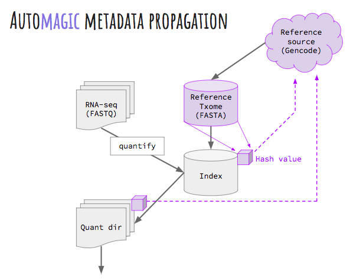
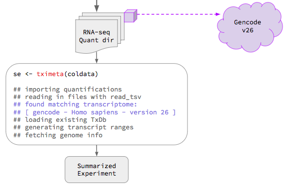

# tximeta: Import transcript quantification with automagic generation of metadata

# Idea in diagrams

Before `tximeta`, current versions of Salmon and Sailfish already 
propogate a *signature* of the transcriptome sequence into the index
and quantification directories. This can be diagrammed like so, where 
the dotted lines represent not direct links, but possible comparisons
that could be made based on signature.



Following quantification, and even performed by a different analyst or 
at a different institute, when importing quantifications into 
R/Bioconductor, the `tximeta` software would check a database of known 
signatures, and upon finding a match, would add annotation and metadata
to the quantifications, returning a `SummarizedExperiment` object.



# Idea in text

`tximeta` performs numerous annotation and metadata gathering tasks on
behalf of users during the import of transcript quantifications from
Salmon or Sailfish into R/Bioconductor. The goal is to provide
something similar to the experience of `GEOquery`, which downloaded
microarray expression data from NCBI GEO and simultaneously brought
along associated pieces of metadata. Doing this automatically helps to
prevent costly bioinformatic errors. To use `tximeta`, all one needs
is the `quant` directory output from Salmon (version >= 0.8.1) or
Sailfish. 

The key idea within `tximeta` is to store a *signature* of
the transcriptome sequence itself using a hash function, computed and
stored by the `index` and `quant` functions of Salmon and
Sailfish. This signature acts as the identifying information for later
building out rich annotations and metadata in the background, on
behalf of the user. This should greatly facilitate genomic workflows,
where the user can immediately begin overlapping their transcriptomic
data with other genomic datasets, e.g. epigenetic tracks such as ChIP
or methylation, as the data has been embedded within an organism and
genome context, including the proper genome version. We seek to
reduce wasted time of bioinformatic analysts, prevent costly
bioinformatic mistakes, and promote computational reproducibility by
avoiding situations of annotation and metadata ambiguity, when files
are shared publicly or among collaborators but critical details go
missing.
	
# This package is in beta 

Expect that this package will change a lot in the coming months. This
is a prototype for how automatic generation of transcriptome metadata
from a transcriptome sequence signature might work.  Note that, as it
is only a prototype, `tximeta` currently supports only the past 5
releases for Gencode (CHR: reference chromosomes only) and Ensembl
(`cdna.all`), for human and mouse. The long term goal will be to
automate signature generation for as many transcriptomes as possible,
including different versions, sources, organisms, etc.

In addition, we are very interested in solving problem cases for this
approach, such as 
[derived transcriptomes](https://github.com/mikelove/tximeta/issues/2)
(e.g. filtered, or edited after downloading from source) and de novo
transcriptomes, such as those generated by StringTie, Trinity,
Scripture, Oases, etc.
We hope that for both of these cases `tximeta` might help to assist in
computational reproducibility of quantification, by encapsulating the
steps need to generate the transcriptome and providing a signature for
checking the sequence is indeed the same.

# Feasability

We plan to progammatically download and hash the cDNA sequence of as
many transcriptomes as possible. Ideally, we could partner with
owners of transcriptome sources and produce cDNA sequence hashes
without downloading, although the download speed is not
prohibitive. Downloading a human transcriptome from GENCODE takes ~5
seconds with a download speed of ~10MB/s, unzipping takes ~1 second,
and hashing the cDNA sequence (excluding sequence names) with
`compute_fasta_digest` takes ~3 seconds. Therefore filling out a
table linking the hash values to metadata for the 5 GENCODE human
transcriptome releases from 2015-2017 can be accomplished in less than
a minute.

# Do I have to use R?

Much of the power of `tximeta` leverages the rich data objects,
annotation resources, and genomic range manipulation methods of the
Bioconductor project, which is built on the R programming
environment. However, it is possible to wrap up the relevant `tximeta`
commands into an R script which can be called from command line, using
[Rscript](https://stat.ethz.ch/R-manual/R-devel/library/utils/html/Rscript.html).
This will create a `SummarizedExperiment` object with relevant
metadata, then deconstruct the object and print its contents into
multiple files. A simple example of such a script is: 

```{r}
coldata <- read.csv("coldata.csv")
library(tximeta)
se <- tximeta(coldata)
# write out the assay data
for (a in assayNames(se)) {
  write.csv(assays(se)[[a]], file=paste0(a,".csv"))
}
# write out the genomic ranges to BED file
library(rtracklayer)
export(rowRanges(se), con="rowRanges.bed")
# write out metadata about genomic ranges
write.csv(as.data.frame(seqinfo(se)), file="seqInfo.csv")
# write out metadata about the transcriptome
write.csv(as.data.frame(metadata(se)$txomeInfo), file="txomeInfo.csv")
```

This script could be run with the following command line call:

```
Rscript tximeta.R
```

# Where the transcript databases are stored

`tximeta` makes use of the Bioconductor *TxDb* object, which can be
saved and re-loaded from an `sqlite` file. These are saved in a
specific location using the *BiocFileCache* package. Since these
*TxDb* saved objects can be ~100 Mb, we want to make sure the user is
OK with these being saved to a given location. Also we want to allow
for the situation that multiple users share a *BiocFileCache*
location, such that any *TxDb* objects or *derivedTxome* information
can be shared, reducing unnecessary downloads or emails asking about
the provenance of the transcriptome for a given set of quantification
files.

We use the following logic to specify the location of the
*BiocFileCache* used by `tximeta`:

* If run **non-interactively**, `tximeta` uses a temporary directory.
* If run **interactively**, and a location has not been previously
  saved, the user is prompted if she wants to use (1) the default directory
  or a (2) temporary directory.
    - If (1), then use the default directory, and save this choice.
    - If (2), then use a temporary directory for the rest of this R session,
      and ask again next R session.
* The prompt above also mentions that a specific function can be used to
  manually set the directory at any time point, and this choice is saved.
* The default directory is given by `rappdirs::user_cache_dir("BiocFileCache")`.
* The choice itself of the BiocFileCache directory that `tximeta` should use is
  saved in a JSON file here `rappdirs::user_cache_dir("tximeta")`.

# Take a look at the example

We have a [prototype vignette](https://github.com/mikelove/tximeta/blob/master/inst/script/tximeta.knit.md)
for how `tximeta` would look, and some thoughts on next steps at the
end of the document. 

Also see how we are thinking to work with [derived transcriptomes](https://github.com/mikelove/tximeta/issues/2).

# Feedback

We'd love to hear your feedback. Please file an 
[Issue on GitHub](https://github.com/mikelove/tximeta/issues).
