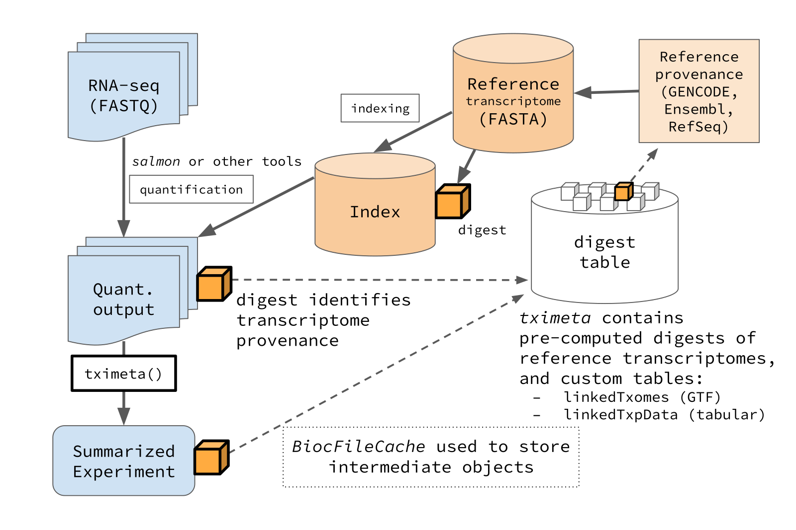

# tximeta: transcript quantification import with automatic metadata

Abstract

*tximeta* performs numerous annotation and metadata gathering tasks on
behalf of users during the import of transcript counts and abundance
from quantification tools such as salmon. Data are imported as
SummarizedExperiment objects with associated GenomicRanges metadata.
Correct metadata is added automatically via reference sequence digests,
facilitating genomic analyses and assisting in computational
reproducibility. Addition functionality is now offered for
quantification with mixed reference transcripts, e.g. GENCODE plus novel
transcripts.

If viewing vignette on Bioconductor, see
[here](https://thelovelab.github.io/tximeta/articles/tximeta.html) for a
nicely rendered version.

## Introduction

The *tximeta* package (Love et al. 2020) extends the *tximport* package
(Soneson et al. 2015) for import of transcript-level quantification data
into R/Bioconductor. It automatically adds annotation metadata when the
RNA-seq data has been quantified with *salmon* (Patro et al. 2017) or
related tools. To our knowledge, *tximeta* is the only package for
RNA-seq data import that can automatically identify and attach
transcriptome metadata based on the unique sequence collection of the
reference transcripts. For more details on these packages – including
the motivation for *tximeta* and description of similar work – consult
the **References** below.

**Note:** For details of using *tximeta* functions with
[oarfish](https://github.com/COMBINE-lab/oarfish), in particular with
separate `--annotated` and `--novel` reference transcripts, refer to
[this section](#mixed-reference-transcripts) below.

**Note:**
[`tximeta()`](https://thelovelab.github.io/tximeta/reference/tximeta.md)
requires that the **entire output** of the quantificaation tool is
present in the output directories and unmodified in order to identify
the provenance of the reference transcripts. In general, it’s a good
idea to not modify or re-arrange the output directory of bioinformatic
software as other downstream software often rely on and assume a
consistent directory structure. For sharing multiple samples, one can
use, for example, `tar -czf` to bundle up a set of *salmon* output
directories. For tips on using
[`tximeta()`](https://thelovelab.github.io/tximeta/reference/tximeta.md)
with other quantifiers see the [other quantifiers](#other-quantifiers)
section below.



## Preparing `tximeta` input

The first step using
[`tximeta()`](https://thelovelab.github.io/tximeta/reference/tximeta.md)
is to read in the sample table, which will become the *column data*,
`colData`, of the final object, a *SummarizedExperiment*. The sample
table should contain all the information we need to identify the
*salmon* quantification directories.

Here we will use a *salmon* quantification file in the *tximportData*
package to demonstrate the usage of `tximeta`. We do not have a sample
table, so we construct one in R. It is recommended to keep a sample
table as a CSV or TSV file while working on an RNA-seq project with
multiple samples.

``` r

dir <- system.file("extdata/salmon_dm", package="tximportData")
files <- file.path(dir, "SRR1197474", "quant.sf") 
file.exists(files)
```

    ## [1] TRUE

``` r

coldata <- data.frame(files, names="SRR1197474", condition="A", stringsAsFactors=FALSE)
coldata
```

    ##                                                                   files
    ## 1 /__w/_temp/Library/tximportData/extdata/salmon_dm/SRR1197474/quant.sf
    ##        names condition
    ## 1 SRR1197474         A

[`tximeta()`](https://thelovelab.github.io/tximeta/reference/tximeta.md)
expects at least two columns in `coldata`:

1.  `files` - a pointer to the `quant.sf` files
2.  `names` - the unique names that should be used to identify samples

Other columns will be propagated to `colData` of the
*SummarizedExperiment* output.

## Running `tximeta`

Normally, we would just run `tximeta` like so:

``` r

library(tximeta)
se <- tximeta(coldata)
```

However, to avoid downloading remote GTF files during this vignette, we
will point to a GTF file saved locally (in the *tximportData* package).
We link the transcriptome of the *salmon* index to its locally saved
GTF. The standard recommended usage of
[`tximeta()`](https://thelovelab.github.io/tximeta/reference/tximeta.md),\
in particular for quantification with reference transcripts with a
[pre-computed digest](#pre-computed-digests), would be the code chunk
above. If one were adding another set of reference transcripts, one
would normally specify a remote GTF source, not a local one. **This
following code is therefore not recommended for a typical workflow, but
is particular to the vignette code.**

``` r

indexDir <- file.path(dir, "Dm.BDGP6.22.98_salmon-0.14.1")
fastaFTP <- c("ftp://ftp.ensembl.org/pub/release-98/fasta/drosophila_melanogaster/cdna/Drosophila_melanogaster.BDGP6.22.cdna.all.fa.gz",
              "ftp://ftp.ensembl.org/pub/release-98/fasta/drosophila_melanogaster/ncrna/Drosophila_melanogaster.BDGP6.22.ncrna.fa.gz")
gtfPath <- file.path(dir,"Drosophila_melanogaster.BDGP6.22.98.gtf.gz")
suppressPackageStartupMessages(library(tximeta))
makeLinkedTxome(indexDir=indexDir,
                source="LocalEnsembl",
                organism="Drosophila melanogaster",
                release="98",
                genome="BDGP6.22",
                fasta=fastaFTP,
                gtf=gtfPath,
                write=FALSE)
```

    ## reading digest from indexDir: .../Dm.BDGP6.22.98_salmon-0.14.1

    ## NOTE: this digest matches one in the pre-computed digest table

    ## saving linkedTxome in bfc (first time)

``` r

library(tximeta)
```

``` r

se <- tximeta(coldata)
```

    ## importing salmon quantification files

    ## reading in files with read.delim (install 'readr' package for speed up)

    ## 1 
    ## found matching linkedTxome:
    ## [ LocalEnsembl - Drosophila melanogaster - release 98 ]
    ## building TxDb with 'txdbmaker' package
    ## Import genomic features from the file as a GRanges object ... OK
    ## Prepare the 'metadata' data frame ... OK
    ## Make the TxDb object ...

    ## Warning in .makeTxDb_normarg_chrominfo(chrominfo): genome version information
    ## is not available for this TxDb object

    ## OK
    ## generating transcript ranges

    ## Warning in checkAssays2Txps(assays, txps): 
    ## 
    ## Warning: the annotation is missing some transcripts that were quantified.
    ## 5 out of 33706 txps were missing from GTF/GFF but were in the indexed FASTA
    ## (e.g. this can occur with transcripts located on haplotype chromosomes).
    ## In order to build a ranged SummarizedExperiment, these txps were removed.
    ## To keep these txps, and to skip adding ranges, use skipMeta=TRUE
    ## 
    ## Example missing txps: [FBtr0307759, FBtr0084079, FBtr0084080, ...]

This warning, “*Warning: the annotation is missing some transcripts that
were quantified.*”, is common and occurs when annotation sources provide
transcripts in the FASTA file that aren’t annotated in the GTF file.
This is upstream of
[`tximeta()`](https://thelovelab.github.io/tximeta/reference/tximeta.md),
but this package will notify you the number of transcripts for which
this is the case.

## How does it work?

[`tximeta()`](https://thelovelab.github.io/tximeta/reference/tximeta.md)
recognized the computed *digest* of the transcriptome that the files
were quantified against, it accessed the GTF file of the transcriptome
source, found and attached the transcript ranges, and added the
appropriate transcriptome and genome metadata. A *digest* is a small
string of alphanumeric characters that uniquely identifies the
collection of sequences that were used for quantification (it is the
hash value from applying the hash function to a particular collection of
nucleotide sequences). We sometimes also call this value a “checksum”
(in the tximeta paper), and we sometimes call the table of pre-computed
digests or linked digests a “hash table”.

Note that a remote GTF is only downloaded once, and a local or remote
GTF is only parsed to build a *TxDb* or *EnsDb* once: if
[`tximeta()`](https://thelovelab.github.io/tximeta/reference/tximeta.md)
recognizes that it has seen this *salmon* index before, it will use a
cached version of the metadata and transcript ranges.

## Packages used for caching metadata

[`tximeta()`](https://thelovelab.github.io/tximeta/reference/tximeta.md)
makes use of Bioconductor packages for storing transcript databases as
*TxDb* or *EnsDb* objects, which both are connected by default to
`sqlite` backends. For GENCODE and RefSeq GTF files,
[`tximeta()`](https://thelovelab.github.io/tximeta/reference/tximeta.md)
uses the *txdbmaker* package to parse the GTF and build a *TxDb*. For
Ensembl GTF files,
[`tximeta()`](https://thelovelab.github.io/tximeta/reference/tximeta.md)
will first attempt to obtain the correct *EnsDb* object using
*AnnotationHub*. The *ensembldb* package (Rainer et al. 2019) contains
classes and methods for extracting relevant data from Ensembl files. If
the *EnsDb* has already been made available on AnnotationHub,
[`tximeta()`](https://thelovelab.github.io/tximeta/reference/tximeta.md)
will download the database directly, which saves the user time parsing
the GTF into a database (to avoid this, set `useHub=FALSE`). If the
relevant *EnsDb* is not available on AnnotationHub,
[`tximeta()`](https://thelovelab.github.io/tximeta/reference/tximeta.md)
will build an *EnsDb* using *ensembldb* after downloading the GTF file.
Again, the download/construction of a transcript database occurs only
once, and upon subsequent usage of *tximeta* functions, the cached
version will be used.

## Pre-computed digests

The following digests for human, mouse, and drosophila reference
transcripts are supported in this version of
[`tximeta()`](https://thelovelab.github.io/tximeta/reference/tximeta.md):

| source  | organism                | releases |
|:--------|:------------------------|:---------|
| GENCODE | Homo sapiens            | 23-50    |
| GENCODE | Mus musculus            | M6-M39   |
| Ensembl | Homo sapiens            | 76-116   |
| Ensembl | Mus musculus            | 76-116   |
| Ensembl | Drosophila melanogaster | 79-115   |
| RefSeq  | Homo sapiens            | p1-p13   |
| RefSeq  | Mus musculus            | p2-p6    |

For Ensembl transcriptomes, we support the combined protein coding
(cDNA) and non-coding (ncRNA) sequences, as well as the protein coding
alone (although the former approach combining coding and non-coding
transcripts is recommended for more accurate quantification).

[`tximeta()`](https://thelovelab.github.io/tximeta/reference/tximeta.md)
also supports *linked transcriptomes*, a mechanism to link
quantification data to key metadata. This can be used to resolve many
potential situations where one of the above pre-computed digests won’t
be a match (due to modifying, re-ordering, adding, or removing
transcripts, which changes the value of the compute digest). See the
[Linked transcriptomes](#linked-transcriptomes) section below for a
demonstration. (The *makeLinkedTxome* function was used above to avoid
downloading the GTF during the vignette building process.)

For *oarfish* quantification (Zare Jousheghani et al. 2025) using the
`--annotated` and `--novel` reference transcripts, use the functions
described [below](#mixed-reference-transcripts).

## SummarizedExperiment output

The `SummarizedExperiment` object resulting from the data import
contains our coldata from before. Note that the `files` column was
removed during the import.

``` r

suppressPackageStartupMessages(library(SummarizedExperiment))
colData(se)
```

    ## DataFrame with 1 row and 2 columns
    ##                  names   condition
    ##            <character> <character>
    ## SRR1197474  SRR1197474           A

Here we show the three matrices that were imported.

``` r

assayNames(se)
```

    ## [1] "counts"    "abundance" "length"

If there were inferential replicates (Gibbs samples or bootstrap
samples), these would be imported as additional assays named
`"infRep1"`, `"infRep2"`, …

[`tximeta()`](https://thelovelab.github.io/tximeta/reference/tximeta.md)
has imported the correct ranges for the transcripts:

``` r

rowRanges(se)
```

    ## GRanges object with 33701 ranges and 3 metadata columns:
    ##               seqnames            ranges strand |     tx_id         gene_id
    ##                  <Rle>         <IRanges>  <Rle> | <integer> <CharacterList>
    ##   FBtr0070129        X     656673-657899      + |     28756     FBgn0025637
    ##   FBtr0070126        X     656356-657899      + |     28752     FBgn0025637
    ##   FBtr0070128        X     656673-657899      + |     28755     FBgn0025637
    ##   FBtr0070124        X     656114-657899      + |     28750     FBgn0025637
    ##   FBtr0070127        X     656356-657899      + |     28753     FBgn0025637
    ##           ...      ...               ...    ... .       ...             ...
    ##   FBtr0114299       2R 21325218-21325323      + |      9300     FBgn0086023
    ##   FBtr0113582       3R   5598638-5598777      - |     24474     FBgn0082989
    ##   FBtr0091635       3L   1488906-1489045      + |     13780     FBgn0086670
    ##   FBtr0113599       3L     261803-261953      - |     16973     FBgn0083014
    ##   FBtr0113600       3L     831870-832008      - |     17070     FBgn0083057
    ##                   tx_name
    ##               <character>
    ##   FBtr0070129 FBtr0070129
    ##   FBtr0070126 FBtr0070126
    ##   FBtr0070128 FBtr0070128
    ##   FBtr0070124 FBtr0070124
    ##   FBtr0070127 FBtr0070127
    ##           ...         ...
    ##   FBtr0114299 FBtr0114299
    ##   FBtr0113582 FBtr0113582
    ##   FBtr0091635 FBtr0091635
    ##   FBtr0113599 FBtr0113599
    ##   FBtr0113600 FBtr0113600
    ##   -------
    ##   seqinfo: 25 sequences from an unspecified genome; no seqlengths

We have appropriate genome information, which prevents us from making
bioinformatic mistakes:

``` r

seqinfo(se)
```

    ## Seqinfo object with 25 sequences from an unspecified genome; no seqlengths:
    ##   seqnames             seqlengths isCircular genome
    ##   2L                         <NA>       <NA>   <NA>
    ##   2R                         <NA>       <NA>   <NA>
    ##   3L                         <NA>       <NA>   <NA>
    ##   3R                         <NA>       <NA>   <NA>
    ##   4                          <NA>       <NA>   <NA>
    ##   ...                         ...        ...    ...
    ##   211000022280481            <NA>       <NA>   <NA>
    ##   211000022280494            <NA>       <NA>   <NA>
    ##   211000022280703            <NA>       <NA>   <NA>
    ##   mitochondrion_genome       <NA>       <NA>   <NA>
    ##   rDNA                       <NA>       <NA>   <NA>

## Retrieve the transcript database

The `se` object has associated metadata that allows `tximeta` to link to
locally stored cached databases and other Bioconductor objects. In
further sections, we will show examples of functions that leverage these
databases to add exon information, summarize transcript-level data to
the gene level, or add identifiers. However, first we mention that the
user can easily access the cached database with the following helper
function. In this case, `tximeta` has an associated *EnsDb* object that
we can retrieve and use in our R session:

``` r

edb <- retrieveDb(se)
```

    ## loading existing TxDb created: 2026-07-20 08:01:54

``` r

class(edb)
```

    ## [1] "TxDb"
    ## attr(,"package")
    ## [1] "GenomicFeatures"

The database returned by `retrieveDb` is either a *TxDb* in the case of
GENCODE or RefSeq GTF annotation file, or an *EnsDb* in the case of an
Ensembl GTF annotation file. For further use of these two database
objects, consult the *GenomicFeatures* vignettes and the *ensembldb*
vignettes, respectively (both Bioconductor packages).

## Add exons per transcript

Because the SummarizedExperiment maintains all the metadata of its
creation, it also keeps a pointer to the necessary database for pulling
out additional information, as demonstrated in the following sections.

If necessary, the *tximeta* package can pull down the remote source to
build a TxDb, but given that we’ve already built a TxDb once, it simply
loads the cached version. In order to remove the cached TxDb and
regenerate, one can remove the relevant entry from the `tximeta` file
cache that resides at the location given by
[`getTximetaBFC()`](https://thelovelab.github.io/tximeta/reference/getTximetaBFC.md).

The `se` object created by `tximeta`, has the start, end, and strand
information for each transcript. Here, we swap out the transcript
*GRanges* for exons-by-transcript *GRangesList* (it is a list of
*GRanges*, where each element of the list gives the exons for a
particular transcript).

``` r

se.exons <- addExons(se)
```

    ## loading existing TxDb created: 2026-07-20 08:01:54

    ## generating exon ranges

``` r

rowRanges(se.exons)[[1]]
```

    ## GRanges object with 2 ranges and 3 metadata columns:
    ##       seqnames        ranges strand |   exon_id      exon_name exon_rank
    ##          <Rle>     <IRanges>  <Rle> | <integer>    <character> <integer>
    ##   [1]        X 656673-656740      + |     72949 FBtr0070129-E1         1
    ##   [2]        X 657099-657899      + |     72952 FBtr0070129-E2         2
    ##   -------
    ##   seqinfo: 25 sequences from an unspecified genome; no seqlengths

As with the transcript ranges, the exon ranges will be generated once
and cached locally. As it takes a non-negligible amount of time to
generate the exon-by-transcript *GRangesList*, this local caching offers
substantial time savings for repeated usage of `addExons` with the same
transcriptome.

We have implemented `addExons` to work only on the transcript-level
*SummarizedExperiment* object. We provide some motivation for this
choice in
[`?addExons`](https://thelovelab.github.io/tximeta/reference/addExons.md).
Briefly, if it is desired to know the exons associated with a particular
gene, we feel that it makes more sense to pull out the relevant set of
exons-by-transcript for the transcripts for this gene, rather than
losing the hierarchical structure (exons to transcripts to genes) that
would occur with a *GRangesList* of exons grouped per gene.

## Easy summarization to gene-level

Likewise, the *tximeta* package can make use of the cached TxDb database
for the purpose of summarizing transcript-level quantifications and bias
corrections to the gene-level. After summarization, the `rowRanges`
reflect the start and end position of the gene, which in Bioconductor
are defined by the leftmost and rightmost genomic coordinates of all the
transcripts. As with the transcript and exons, the gene ranges are
cached locally for repeated usage. The transcript IDs are stored as a
*CharacterList* column `tx_ids`.

**Note:** you can also use `summarizeToGene` on an object created with
`skipMeta=TRUE` which therefore does not have ranges or an associated
*TxDb* by setting `skipRanges=TRUE` and providing your own `tx2gene`
table which is passed to `tximport`.

``` r

gse <- summarizeToGene(se)
```

    ## loading existing TxDb created: 2026-07-20 08:01:54

    ## obtaining transcript-to-gene mapping from database

    ## generating gene ranges

    ## assignRanges='range': gene ranges assigned by total range of isoforms
    ##   see details at: ?summarizeToGene,SummarizedExperiment-method

    ## summarizing abundance

    ## summarizing counts

    ## summarizing length

``` r

rowRanges(gse)
```

    ## GRanges object with 17208 ranges and 2 metadata columns:
    ##               seqnames            ranges strand |     gene_id
    ##                  <Rle>         <IRanges>  <Rle> | <character>
    ##   FBgn0000003       3R   6822498-6822796      + | FBgn0000003
    ##   FBgn0000008       2R 22136968-22172834      + | FBgn0000008
    ##   FBgn0000014       3R 16807214-16830049      - | FBgn0000014
    ##   FBgn0000015       3R 16927212-16972236      - | FBgn0000015
    ##   FBgn0000017       3L 16615866-16647882      - | FBgn0000017
    ##           ...      ...               ...    ... .         ...
    ##   FBgn0286199       3R 24279572-24281576      + | FBgn0286199
    ##   FBgn0286203       2R   5413744-5456095      + | FBgn0286203
    ##   FBgn0286204       3R   8950246-8963037      - | FBgn0286204
    ##   FBgn0286213       3L 13023352-13024762      + | FBgn0286213
    ##   FBgn0286222        X   6678424-6681845      + | FBgn0286222
    ##                                                tx_ids
    ##                                       <CharacterList>
    ##   FBgn0000003                             FBtr0081624
    ##   FBgn0000008 FBtr0071763,FBtr0100521,FBtr0342981,...
    ##   FBgn0000014 FBtr0306337,FBtr0083388,FBtr0083387,...
    ##   FBgn0000015 FBtr0415463,FBtr0415464,FBtr0083385,...
    ##   FBgn0000017 FBtr0112790,FBtr0345369,FBtr0075357,...
    ##           ...                                     ...
    ##   FBgn0286199                             FBtr0084600
    ##   FBgn0286203 FBtr0299918,FBtr0299920,FBtr0299921,...
    ##   FBgn0286204                 FBtr0082014,FBtr0334329
    ##   FBgn0286213                             FBtr0075878
    ##   FBgn0286222                 FBtr0070953,FBtr0070954
    ##   -------
    ##   seqinfo: 25 sequences from an unspecified genome; no seqlengths

### Assign ranges by abundance

We also offer a new type of range assignment, based on the most abundant
isoform rather than the leftmost to rightmost coordinate. See the
`assignRanges` argument of `?summarizeToGene`. Using the most abundant
isoform arguably will reflect more accurate genomic distances than the
default option.

``` r

# unevaluated code chunk
gse <- summarizeToGene(se, assignRanges="abundant")
```

For more explanation about why this may be a better choice, see the
following tutorial chapter:

<https://tidyomics.github.io/tidy-ranges-tutorial/gene-ranges-in-tximeta.html>

In the below diagram, the pink feature is the set of all exons belonging
to any isoform of the gene, such that the TSS is on the right side of
this minus strand feature. However, the blue feature is the most
abundant isoform (the brown features are the next most abundant
isoforms). The pink feature is therefore not a good representation for
the locus.


## Add different identifiers

We would like to add support to easily map transcript or gene
identifiers from one annotation to another. This is just a prototype
function, but we show how we can easily add alternate IDs given that we
know the organism and the source of the transcriptome. (This function
currently only works for GENCODE and Ensembl gene or transcript IDs but
could be extended to work for arbitrary sources.)

``` r

library(org.Dm.eg.db)
```

    ## 

``` r

gse <- addIds(gse, "REFSEQ", gene=TRUE)
```

    ## mapping to new IDs using org.Dm.eg.db
    ## if all matching IDs are desired, and '1:many mappings' are reported,
    ## set multiVals='list' to obtain all the matching IDs

    ## 'select()' returned 1:many mapping between keys and columns

``` r

mcols(gse)
```

    ## DataFrame with 17208 rows and 3 columns
    ##                 gene_id                                  tx_ids       REFSEQ
    ##             <character>                         <CharacterList>  <character>
    ## FBgn0000003 FBgn0000003                             FBtr0081624    NR_001992
    ## FBgn0000008 FBgn0000008 FBtr0071763,FBtr0100521,FBtr0342981,... NM_001014543
    ## FBgn0000014 FBgn0000014 FBtr0306337,FBtr0083388,FBtr0083387,... NM_001170161
    ## FBgn0000015 FBgn0000015 FBtr0415463,FBtr0415464,FBtr0083385,... NM_001275719
    ## FBgn0000017 FBgn0000017 FBtr0112790,FBtr0345369,FBtr0075357,... NM_001104153
    ## ...                 ...                                     ...          ...
    ## FBgn0286199 FBgn0286199                             FBtr0084600    NM_142982
    ## FBgn0286203 FBgn0286203 FBtr0299918,FBtr0299920,FBtr0299921,... NM_001144134
    ## FBgn0286204 FBgn0286204                 FBtr0082014,FBtr0334329 NM_001275464
    ## FBgn0286213 FBgn0286213                             FBtr0075878    NM_168534
    ## FBgn0286222 FBgn0286222                 FBtr0070953,FBtr0070954    NM_132111

## Differential gene expression analysis

The following code chunk demonstrates how to build a *DESeqDataSet* and
begin a differential expression analysis with genewise counts.

``` r

suppressPackageStartupMessages(library(DESeq2))
# here there is a single sample so we use ~1.
# expect a warning that there is only a single sample...
suppressWarnings({dds <- DESeqDataSet(gse, ~1)})
# ... see DESeq2 vignette
```

The following code demonstrates how build a *DGEList* object for use
with *edgeR* or *limma-voom*.

``` r

suppressPackageStartupMessages(library(edgeR))
y <- DGEListFromTximeta(gse)
# ... see edgeR or limma User's Guide for further steps
```

Above we generated counts-from-abundance when calling `summarizeToGene`.
The counts-from-abundance status is then stored in the metadata:

``` r

metadata(gse)$countsFromAbundance 
```

    ## [1] "no"

## Differential transcript expression and usage analysis

The *Swish* method in the *fishpond* package directly works with the
*SummarizedExperiment* output from *tximeta*, and can perform
differential analysis on transcript expression taking into account
inferential replicates, e.g. bootstrap or Gibbs samples, which are
imported and arranged by `tximeta` if these were generated during
quantification.

``` r

library(fishpond)
y <- se
y <- scaleInfReps(y)
y <- labelKeep(y)
y <- swish(y, x="condition")
# ... see Swish vignette in fishpond package
```

The
[`edgeR::DGEListFromTximeta`](https://rdrr.io/pkg/edgeR/man/DGEListFromTximport.html)
function uses the inferential replicates found in `se` or `gse` to
estimate the overdispersion for each transcript or gene arising from the
fact that reads have to be assigned probabilistically to transcripts by
the quantification software (*salmon* in this case). The
`DGEListFromTximeta` function is available in *edgeR* as of version
4.10.0 (Bioconductor release 3.23, Spring 2026). Differential analyses
of transcript expression or usage can be conducted in *edgeR* or *limma*
using “divided counts”, whereby the overdispersion is divided out of the
counts (Baldoni et al. 2024, 2025). The following code produces a
*DGEList* object suitable for transcript-level analysis in *edgeR* or
*limma*.

``` r

y <- DGEListFromTximeta(se, divide = TRUE)
# ... see edgeR or limma User's Guide for further steps
```

## Additional metadata slots

The following information is attached to the *SummarizedExperiment* by
`tximeta`:

``` r

names(metadata(se))
```

    ## [1] "tximetaInfo"         "quantInfo"           "countsFromAbundance"
    ## [4] "level"               "txomeInfo"           "txdbInfo"

``` r

str(metadata(se)[["quantInfo"]])
```

    ## List of 31
    ##  $ salmon_version                                        : chr "0.14.1"
    ##  $ samp_type                                             : chr "none"
    ##  $ opt_type                                              : chr "vb"
    ##  $ quant_errors                                          :List of 1
    ##   ..$ : list()
    ##  $ num_libraries                                         : int 1
    ##  $ library_types                                         : chr "ISR"
    ##  $ frag_dist_length                                      : int 1001
    ##  $ seq_bias_correct                                      : logi FALSE
    ##  $ gc_bias_correct                                       : logi TRUE
    ##  $ num_bias_bins                                         : int 4096
    ##  $ mapping_type                                          : chr "mapping"
    ##  $ num_valid_targets                                     : int 33706
    ##  $ num_decoy_targets                                     : int 0
    ##  $ num_eq_classes                                        : int 70718
    ##  $ serialized_eq_classes                                 : logi FALSE
    ##  $ length_classes                                        : int [1:5, 1] 867 1533 2379 3854 71382
    ##  $ index_seq_hash                                        : chr "7ba5e9597796ea86cf11ccf6635ca88fbc37c2848d38083c23986aa2c6a21eae"
    ##  $ index_name_hash                                       : chr "b6426061057bba9b7afb4dc76fa68238414cf35b4190c95ca6fc44280d4ca87c"
    ##  $ index_seq_hash512                                     : chr "05f111abcda1efd2e489ace6324128cdaaa311712a28ed716d957fdfd8706ec41ca9177ebf12f54e99c2a89582d06f31c5e09dc1dce2d13"| __truncated__
    ##  $ index_name_hash512                                    : chr "ccdf58f23e48c8c53cd122b5f5990b5adce9fec87ddf8bd88153afbe93296d87b818fba89d12dbc20c882f7d98353840394c5040fea7432"| __truncated__
    ##  $ num_bootstraps                                        : int 0
    ##  $ num_processed                                         : int 42422337
    ##  $ num_mapped                                            : int 34098209
    ##  $ num_decoy_fragments                                   : int 0
    ##  $ num_dovetail_fragments                                : int 2048810
    ##  $ num_fragments_filtered_vm                             : int 989383
    ##  $ num_alignments_below_threshold_for_mapped_fragments_vm: int 267540
    ##  $ percent_mapped                                        : num 80.4
    ##  $ call                                                  : chr "quant"
    ##  $ start_time                                            : chr "Sat Oct 12 13:55:01 2019"
    ##  $ end_time                                              : chr "Sat Oct 12 14:08:11 2019"

``` r

str(metadata(se)[["txomeInfo"]])
```

    ## List of 10
    ##  $ index        : chr "Dm.BDGP6.22.98_salmon-0.14.1"
    ##  $ source       : chr "LocalEnsembl"
    ##  $ organism     : chr "Drosophila melanogaster"
    ##  $ release      : chr "98"
    ##  $ genome       : chr "BDGP6.22"
    ##  $ fasta        :List of 1
    ##   ..$ : chr [1:2] "ftp://ftp.ensembl.org/pub/release-98/fasta/drosophila_melanogaster/cdna/Drosophila_melanogaster.BDGP6.22.cdna.all.fa.gz" "ftp://ftp.ensembl.org/pub/release-98/fasta/drosophila_melanogaster/ncrna/Drosophila_melanogaster.BDGP6.22.ncrna.fa.gz"
    ##  $ gtf          : chr "/__w/_temp/Library/tximportData/extdata/salmon_dm/Drosophila_melanogaster.BDGP6.22.98.gtf.gz"
    ##  $ sha256       : chr "7ba5e9597796ea86cf11ccf6635ca88fbc37c2848d38083c23986aa2c6a21eae"
    ##  $ linkedTxome  : Named logi TRUE
    ##   ..- attr(*, "names")= chr "txome"
    ##  $ linkedTxpData: Named logi FALSE
    ##   ..- attr(*, "names")= chr "txome"

``` r

str(metadata(se)[["tximetaInfo"]])
```

    ## List of 3
    ##  $ version   :Classes 'package_version', 'numeric_version'  hidden list of 1
    ##   ..$ : int [1:3] 1 31 8
    ##  $ type      : chr "salmon"
    ##  $ importTime: POSIXct[1:1], format: "2026-07-20 08:01:46"

``` r

str(metadata(se)[["txdbInfo"]])
```

    ##  Named chr [1:12] "TxDb" "GenomicFeatures" ...
    ##  - attr(*, "names")= chr [1:12] "Db type" "Supporting package" "Data source" "Organism" ...

## Mixed reference transcripts

The [oarfish](https://github.com/COMBINE-lab/oarfish) (Zare Jousheghani
et al. 2025) quantification tool and *salmon* allow specifying distinct
*annotated* reference transcripts (e.g. GENCODE, Ensembl) and *novel*
reference transcripts (e.g. *de novo* assemblies) which are combined
together as the index for alignment and quantification. *tximeta* can
now automatically recognize the provenance of reference transcripts even
when sets from different sources are combined.

For example, *oarfish* code for indexing and quantification follows the
paradigm:

    oarfish --only-index --annotated gencode.v48.transcripts.fa.gz \
      --novel my_novel_txps.fa.gz --seq-tech ont-cdna --threads 32 \
      --index-out gencode_plus_novel
    oarfish --reads reads/experiment_rep1.fastq.gz --index gencode_plus_novel \
      --output quants/experiment_rep1 --seq-tech ont-cdna \
      --filter-group no-filters --threads 32


Here we introduce a new workflow for importing data and linking
quantification data to metadata, designed for this mixed reference
transcript situation, but which may be generalized in the future for
other transcript quantification settings.

- [`importData()`](https://thelovelab.github.io/tximeta/reference/importData.md) -
  imports data as an un-ranged *SummarizedExperiment*
- [`inspectDigests()`](https://thelovelab.github.io/tximeta/reference/inspectDigests.md) -
  inspects the digest status of the indices for imported data
- [`updateMetadata()`](https://thelovelab.github.io/tximeta/reference/updateMetadata.md) -
  assists in attaching metadata from matching reference transcriptomes
- and *linkedTxpData*, a lightweight version of *linkedTxome*, described
  [below](#linked-transcriptomes)

Below is an un-evaluated code chunk with typical code you may use for an
experiment called `experiment` with samples `rep1` to `rep4`:

``` r

# specify oarfish .quant files
# quantified against an index of two .fa files, e.g.:
# `--annotated gencode.v48.transcripts.fa.gz --novel my_novel_txps.fa.gz`
names <- paste0("rep", 1:4)
files <- file.path(dir, paste0("experiment_", names, ".quant.gz"))
coldata <- data.frame(files, names) # the sample info table
se <- importData(coldata, type="oarfish")
```

### salmon mixed reference

*salmon* does not record per-sub-index digests natively. To enable the
same mixed reference workflow, a companion Snakemake rule runs
[`compute_fasta_digest`](https://github.com/COMBINE-lab/FastaDigest) on
the annotated and novel FASTAs at index time and writes a
`mixed_ref_digests.json` file into each quantification output directory
alongside `quant.sf`. The Snakemake rules and further details are
available at
[thelovelab/salmon-with-mixed-ref](https://github.com/thelovelab/salmon-with-mixed-ref).

Pass the digest filename to
[`importData()`](https://thelovelab.github.io/tximeta/reference/importData.md)
via the `mixedDigest` argument:

``` r

# specify salmon quant.sf files, quantified against a combined annotated + novel index
names <- paste0("rep", 1:4)
files <- file.path(dir, paste0("experiment_", names, "/quant.sf"))
coldata <- data.frame(files, names)
se <- importData(coldata, type="salmon", mixedDigest="mixed_ref_digests.json")
```

The returned object and all subsequent steps
([`inspectDigests()`](https://thelovelab.github.io/tximeta/reference/inspectDigests.md),
[`updateMetadata()`](https://thelovelab.github.io/tximeta/reference/updateMetadata.md))
are identical to the oarfish workflow described below.

### Importing oarfish data

Below is an evaluated code chunk which first points to the location of
the dataset used for the vignette. The above code chunk is more typical
for a user however.

``` r

dir <- system.file("extdata/oarfish", package="tximportData")
names <- paste0("rep", 2:4)
files <- file.path(dir, paste0("sgnex_h9_", names, ".quant.gz"))
coldata <- data.frame(files, names)
# read in the quantification data
se <- importData(coldata, type="oarfish")
```

    ## reading in files with read.delim (install 'readr' package for speed up)

    ## 1 2 3 
    ## returning un-ranged SummarizedExperiment, see functions:
    ## -- inspectDigests() to check matching digests
    ## -- makeLinkedTxome/makeLinkedTxpData() to link digests to metadata
    ## -- updateMetadata() to update metadata and optionally add ranges

The
[`importData()`](https://thelovelab.github.io/tximeta/reference/importData.md)
function returns an un-ranged SummarizedExperiment, with no metadata
attached. This is similar to what
[`tximeta()`](https://thelovelab.github.io/tximeta/reference/tximeta.md)
does with `skipMeta=TRUE`.

``` r

class(se)
```

    ## [1] "SummarizedExperiment"
    ## attr(,"package")
    ## [1] "SummarizedExperiment"

``` r

rowData(se)
```

    ## DataFrame with 423044 rows and 0 columns

We can now inspect the digests of the two indices:

``` r

# returns a 2-row tibble
# (here localGENCODE avoids downloading an ftp file)
inspectDigests(se)
```

    ## # A tibble: 2 × 8
    ##   index    source organism release genome linkedTxome linkedTxpData small_digest
    ##   <chr>    <chr>  <chr>    <chr>   <chr>  <lgl>       <lgl>         <chr>       
    ## 1 annotat… Local… Homo sa… 48      GRCh38 TRUE        FALSE         6fc626      
    ## 2 novel    NA     NA       NA      NA     NA          NA            43158f

We can see the `source` and other annotation details for `annotated` and
for `novel`. If a match is found in the pre-computed digests, the
[linkedTxome](#linked-transcriptomes) digests, or the `linkedTxpData`
digests, it will populate the `source` to `genome` columns and will
indicate if it is a `linkedTxome` or `linkedTxpData` match.

**Note**: `linkedTxpData` is a newly developed, lightweight version of
`linkedTxome`, which links quantification data to metadata in the form
of a *GRanges* object for a set of transcripts. For more details see the
man page for
[`makeLinkedTxpData()`](https://thelovelab.github.io/tximeta/reference/linkedTxpData.md).

If both `linkedTxome` and `linkedTxpData` are `FALSE` and the metadata
is populated, the digest was a match among the [pre-computed
digests](#pre-computed-digests).

A small 6-character version of the digest is printed. One can also
obtain the full digest (shown below).

``` r

inspectDigests(se, fullDigest=TRUE)
```

    ## # A tibble: 2 × 9
    ##   index    source organism release genome linkedTxome linkedTxpData small_digest
    ##   <chr>    <chr>  <chr>    <chr>   <chr>  <lgl>       <lgl>         <chr>       
    ## 1 annotat… Local… Homo sa… 48      GRCh38 TRUE        FALSE         6fc626      
    ## 2 novel    NA     NA       NA      NA     NA          NA            43158f      
    ## # ℹ 1 more variable: digest <chr>

One can also obtain the count (`count=TRUE`) of matching transcripts per
index, which involves loading transcript data from locally cached
sources (or generating these from local or remote GTF as needed).

Inspection can be run iteratively, in combination with
[`makeLinkedTxome()`](https://thelovelab.github.io/tximeta/reference/linkedTxome.md)
described [below](#linked-transcriptomes) or
[`makeLinkedTxpData()`](https://thelovelab.github.io/tximeta/reference/linkedTxpData.md),
in order to match up missing digests with GTF files and/or range-based
metadata.

The next step is to run
[`updateMetadata()`](https://thelovelab.github.io/tximeta/reference/updateMetadata.md).
This function does what
[`tximeta()`](https://thelovelab.github.io/tximeta/reference/tximeta.md)
does by default for a single index, by adding available metadata and
attaching to `rowData`. Thus
[`updateMetadata()`](https://thelovelab.github.io/tximeta/reference/updateMetadata.md)
overlaps with previous behavior by
[`addIds()`](https://thelovelab.github.io/tximeta/reference/addIds.md).
Some options here are to add `ranges=TRUE` which populates `rowRanges`
but necessitates removing transcripts (rows) without range information.
Here, transcripts are preserved but `NA` filled in for columns where we
don’t have metadata.

``` r

se_update <- updateMetadata(se)
```

    ## Warning in .get_cds_IDX(mcols0$type, mcols0$phase): The "phase" metadata column contains non-NA values for features of type
    ##   stop_codon. This information was ignored.

    ## Warning in .makeTxDb_normarg_chrominfo(chrominfo): genome version information
    ## is not available for this TxDb object

    ## --annotated: adding metadata for 385669 transcripts

    ## --novel: no transcript metadata found
    ##   consider using `linkedTxome`, or `linkedTxpData` (see man pages)

    ## --novel: no matching transcripts

``` r

mcols(se_update)
```

    ## DataFrame with 423044 rows and 4 columns
    ##                             tx_name     tx_id           gene_id       index
    ##                         <character> <integer>   <CharacterList> <character>
    ## ENST00000832824.1 ENST00000832824.1         1 ENSG00000290825.2   annotated
    ## ENST00000832825.1 ENST00000832825.1         2 ENSG00000290825.2   annotated
    ## ENST00000832826.1 ENST00000832826.1         3 ENSG00000290825.2   annotated
    ## ENST00000832827.1 ENST00000832827.1         4 ENSG00000290825.2   annotated
    ## ENST00000832828.1 ENST00000832828.1         5 ENSG00000290825.2   annotated
    ## ...                             ...       ...               ...         ...
    ## novel10996               novel10996        NA                NA          NA
    ## novel10997               novel10997        NA                NA          NA
    ## novel10998               novel10998        NA                NA          NA
    ## novel10999               novel10999        NA                NA          NA
    ## novel11000               novel11000        NA                NA          NA

[`updateMetadata()`](https://thelovelab.github.io/tximeta/reference/updateMetadata.md)
also allows adding metadata manually, either in the form of a *GRanges*
object or *data.frame*-like object. Note that
[`makeLinkedTxpData()`](https://thelovelab.github.io/tximeta/reference/linkedTxpData.md)
can be used for persistent addition of *GRanges* metadata across
sessions.

``` r

# define novel set so we can add metadata
novel <- data.frame(
  seqnames = paste0("chr", rep(1:22, each = 500)),
  start = 1e6 + 1 + 0:499 * 1000,
  end = 1e6 + 1 + 0:499 * 1000 + 1000 - 1,
  strand = "+",
  tx_name = paste0("novel", 1:(22 * 500)),
  gene_id = paste0("novel_gene", rep(1:(22 * 10), each = 50)),
  type = "protein_coding"
)
head(novel)
```

    ##   seqnames   start     end strand tx_name     gene_id           type
    ## 1     chr1 1000001 1001000      +  novel1 novel_gene1 protein_coding
    ## 2     chr1 1001001 1002000      +  novel2 novel_gene1 protein_coding
    ## 3     chr1 1002001 1003000      +  novel3 novel_gene1 protein_coding
    ## 4     chr1 1003001 1004000      +  novel4 novel_gene1 protein_coding
    ## 5     chr1 1004001 1005000      +  novel5 novel_gene1 protein_coding
    ## 6     chr1 1005001 1006000      +  novel6 novel_gene1 protein_coding

``` r

library(GenomicRanges)
novel_gr <- as(novel, "GRanges")
names(novel_gr) <- novel$tx_name
```

Metadata specified via the `txpData` argument will be added to
transcript labelled with `index="user"`.

``` r

se_with_ranges <- updateMetadata(se, txpData=novel_gr, ranges=TRUE)
```

    ## --annotated: adding metadata for 385669 transcripts

    ## --novel: no transcript metadata found
    ##   consider using `linkedTxome`, or `linkedTxpData` (see man pages)

    ## --novel: no matching transcripts

    ## --user: adding metadata for 11000 transcripts

    ## building RangedSE: subsetting to 396669 out of 423044 rows with range data

``` r

rowRanges(se_with_ranges)
```

    ## GRanges object with 396669 ranges and 5 metadata columns:
    ##                     seqnames          ranges strand |           tx_name
    ##                        <Rle>       <IRanges>  <Rle> |       <character>
    ##   ENST00000832824.1     chr1     11121-14413      + | ENST00000832824.1
    ##   ENST00000832825.1     chr1     11125-14405      + | ENST00000832825.1
    ##   ENST00000832826.1     chr1     11410-14413      + | ENST00000832826.1
    ##   ENST00000832827.1     chr1     11411-14413      + | ENST00000832827.1
    ##   ENST00000832828.1     chr1     11426-14409      + | ENST00000832828.1
    ##                 ...      ...             ...    ... .               ...
    ##          novel10996    chr22 1495001-1496000      + |        novel10996
    ##          novel10997    chr22 1496001-1497000      + |        novel10997
    ##          novel10998    chr22 1497001-1498000      + |        novel10998
    ##          novel10999    chr22 1498001-1499000      + |        novel10999
    ##          novel11000    chr22 1499001-1500000      + |        novel11000
    ##                         tx_id           gene_id       index           type
    ##                     <integer>   <CharacterList> <character>    <character>
    ##   ENST00000832824.1         1 ENSG00000290825.2   annotated             NA
    ##   ENST00000832825.1         2 ENSG00000290825.2   annotated             NA
    ##   ENST00000832826.1         3 ENSG00000290825.2   annotated             NA
    ##   ENST00000832827.1         4 ENSG00000290825.2   annotated             NA
    ##   ENST00000832828.1         5 ENSG00000290825.2   annotated             NA
    ##                 ...       ...               ...         ...            ...
    ##          novel10996      <NA>     novel_gene220        user protein_coding
    ##          novel10997      <NA>     novel_gene220        user protein_coding
    ##          novel10998      <NA>     novel_gene220        user protein_coding
    ##          novel10999      <NA>     novel_gene220        user protein_coding
    ##          novel11000      <NA>     novel_gene220        user protein_coding
    ##   -------
    ##   seqinfo: 25 sequences (1 circular) from an unspecified genome; no seqlengths

Two additional details for
[`inspectDigests()`](https://thelovelab.github.io/tximeta/reference/inspectDigests.md)
and
[`updateMetadata()`](https://thelovelab.github.io/tximeta/reference/updateMetadata.md):

1.  The argument `prefer` specifies the preferred order of digest match
    across various *tximeta* registries. Default is `txome`:
    linkedTxome, then `txpdata`: linkedTxpData, finally `precomputed`.
2.  One can specify per index, the `key`, *i.e.* the name of the column
    used for matching metadata. By default `tx_name` is used.

This new workflow for data import is under active development, feel free
to post an [Issue](https://github.com/thelovelab/tximeta/issues/new)
with any feedback.

## Errors connecting to a database

`tximeta` makes use of *BiocFileCache* to store transcript and other
databases, so saving the relevant databases in a centralized location
used by other Bioconductor packages as well. It is possible that an
error can occur in connecting to these databases, either if the files
were accidentally removed from the file system, or if there was an error
generating or writing the database to the cache location. In each of
these cases, it is easy to remove the entry in the *BiocFileCache* so
that `tximeta` will know to regenerate the transcript database or any
other missing database.

If you have used the default cache location, then you can obtain access
to your BiocFileCache with:

``` r

library(BiocFileCache)
```

    ## Loading required package: dbplyr

``` r

bfc <- BiocFileCache()
```

Otherwise, you can recall your particular `tximeta` cache location with
[`getTximetaBFC()`](https://thelovelab.github.io/tximeta/reference/getTximetaBFC.md).

You can then inspect the entries in your BiocFileCache using `bfcinfo`
and remove the entry associated with the missing database with
`bfcremove`. See the BiocFileCache vignette for more details on finding
and removing entries from a BiocFileCache.

Note that there may be many entries in the BiocFileCache location,
including `.sqlite` database files and serialized `.rds` files. You
should only remove the entry associated with the missing database,
e.g. if R gave an error when trying to connect to the TxDb associated
with GENCODE v99 human transcripts, you should look for the `rid` of the
entry associated with the human v99 GTF from GENCODE.

## What if digest isn’t known?

`tximeta` automatically imports relevant metadata when the transcriptome
matches a known source – *known* in the sense that it is in the set of
pre-computed digests in `tximeta` (GENCODE, Ensembl, and RefSeq for
human and mouse). `tximeta` also facilitates the linking of
transcriptomes used in building the *salmon* index with relevant public
sources, in the case that these are not part of this pre-computed set
known to `tximeta`. The linking of the transcriptome source with the
quantification files is important in the case that the transcript
sequence no longer matches a known source (uniquely combined or filtered
FASTA files), or if the source is not known to `tximeta`. Combinations
of coding and non-coding human, mouse, and fruit fly *Ensembl*
transcripts should be automatically recognized by `tximeta` and does not
require making a *linkedTxome*. As the package is further developed, we
plan to roll out support for all common transcriptomes, from all
sources.

**Note:** if you are using *salmon* in alignment mode, then there is no
salmon index, and without the salmon index, there is no digest. We don’t
have a perfect solution for this yet, but you can still summarize
transcript counts to gene with a `tx2gene` table that you construct
manually (see `tximport` vignette for example code). Just specify the
arguments, `skipMeta=TRUE, txOut=FALSE, tx2gene=tx2gene`, when calling
`tximeta` and it will perform summarization to gene level as in
`tximport`.

We now demonstrate how to make a *linkedTxome* and how to share and load
a *linkedTxome*. We point to a *salmon* quantification file which was
quantified against a transcriptome that included the coding and
non-coding *Drosophila melanogaster* transcripts, as well as an
artificial transcript of 960 bp (for demonstration purposes only).

``` r

dir <- system.file("extdata/salmon_dm", package="tximportData")
file <- file.path(dir, "SRR1197474.plus", "quant.sf")
file.exists(file)
```

    ## [1] TRUE

``` r

coldata <- data.frame(files=file, names="SRR1197474", sample="1",
                      stringsAsFactors=FALSE)
```

Trying to import the files gives a message that `tximeta` couldn’t find
a matching transcriptome, so it returns an non-ranged
*SummarizedExperiment*.

``` r

se <- tximeta(coldata)
```

    ## importing salmon quantification files

    ## reading in files with read.delim (install 'readr' package for speed up)

    ## 1 
    ## couldn't find matching transcriptome, returning non-ranged SummarizedExperiment

## Linked transcriptomes

If the transcriptome used to generate the *salmon* index does not match
any transcriptomes from known sources (e.g. from combining or filtering
known transcriptome files), there is not much that can be done to
automatically populate the metadata during quantification import.
However, we can facilitate the following two cases:

1.  the transcriptome was created locally and has been linked to its
    public source(s)
2.  the transcriptome was produced by another group, and they have
    produced and shared a file that links the transcriptome to public
    source(s)

`tximeta` offers functionality to assist reproducible analysis in both
of these cases.

To make this quantification reproducible, we make a `linkedTxome` which
records key information about the sources of the transcript FASTA files,
and the location of the relevant GTF file. It also records the digest of
the transcriptome that was computed by *salmon* during the `index` step.

**Source:** when creating the `linkedTxome` one must specify the
`source` of the transcriptome. See
[`?linkedTxome`](https://thelovelab.github.io/tximeta/reference/linkedTxome.md)
for a note on the implications of this text string. For canonical
GENCODE or Ensembl transcriptomes, one can use `"GENCODE"` or
`"Ensembl"`, but for modified or otherwise any transcriptomes defined by
a local database, it is recommended to use a different string,
`"LocalGENCODE"` or \`“LocalEnsembl”, which will avoid *tximeta* pulling
canonical GENCODE or Ensembl resources from AnnotationHub.

**Multiple GTF/GFF files:** `linkedTxome` and `tximeta` do not currently
support multiple GTF/GFF files, which is a more complicated case than
multiple FASTA, which is supported. Currently, we recommend that users
should add or combine GTF/GFF files themselves to create a single
GTF/GFF file that contains all features used in quantification, and then
upload such a file to *Zenodo*, which can then be linked as shown below.
Feel free to contact the developers on the Bioconductor support site or
GitHub Issue page for further details or feature requests.

**Stringtie:** A special note for building on top of Stringtie-generated
transcripts: it is a good idea to change gene identifiers, to *not*
include a period `.`, as the period will later be used to separate
transcript versions from gene identifiers. This can be done before
building the salmon index, by changing periods in the gene identifier to
an underscore. See [this GitHub
issue](https://github.com/thelovelab/tximeta/issues/68) for details.

By default, `linkedTxome` will write out a JSON file which can be shared
with others, linking the digest of the index with the other metadata,
including FASTA and GTF sources. By default, it will write out to a file
with the same name as the `indexDir`, but with a `.json` extension
added. This can be prevented with `write=FALSE`, and the file location
can be changed with `jsonFile`.

First we specify the path where *salmon* index directory with
`indexDir`, which will be used to look up the digest and associate it
with the index. Alternatively one can specify the `digest` itself and an
`indexName`.

Typically you would not use `system.file` and `file.path` to locate this
directory, but simply define `indexDir` to be the path of the *salmon*
directory on your machine. Here we use `system.file` and `file.path`
because we have included parts of a *salmon* index directory in the
*tximeta* package itself for demonstration of functionality in this
vignette.

``` r

indexDir <- file.path(dir, "Dm.BDGP6.22.98.plus_salmon-0.14.1")
```

Now we provide the location of the FASTA files and the GTF file for this
transcriptome.

**Note:** the basename for the GTF file is used as a unique identifier
for the cached versions of the *TxDb* and the transcript ranges, which
are stored on the user’s behalf via *BiocFileCache*. This is not an
issue, as GENCODE, Ensembl, and RefSeq all provide GTF files which are
uniquely identified by their filename,
e.g. `Drosophila_melanogaster.BDGP6.22.98.gtf.gz`.

The recommended usage of `tximeta` would be to specify a remote GTF
source, as seen in the commented-out line below:

``` r

fastaFTP <- c("ftp://ftp.ensembl.org/pub/release-98/fasta/drosophila_melanogaster/cdna/Drosophila_melanogaster.BDGP6.22.cdna.all.fa.gz",
              "ftp://ftp.ensembl.org/pub/release-98/fasta/drosophila_melanogaster/ncrna/Drosophila_melanogaster.BDGP6.22.ncrna.fa.gz",
              "extra_transcript.fa.gz")
#gtfFTP <- "ftp://path/to/custom/Drosophila_melanogaster.BDGP6.22.98.plus.gtf.gz"
```

Instead of the above commented-out FTP location for the GTF file, we
specify a location within an R package. This step is just to avoid
downloading from a remote FTP during vignette building. This use of
`file.path` to point to a file in an R package is specific to this
vignette and should not be used in a typical workflow. The following GTF
file is a modified version of the release 98 from Ensembl, which
includes description of a one transcript, one exon artificial gene which
was inserted into the transcriptome (for demonstration purposes only).

``` r

gtfPath <- file.path(dir,"Drosophila_melanogaster.BDGP6.22.98.plus.gtf.gz")
```

Finally, we create a *linkedTxome*. In this vignette, we point to a
temporary directory for the JSON file, but a more typical workflow would
write the JSON file to the same location as the *salmon* index by not
specifying `jsonFile`.

`makeLinkedTxome` performs two operation: (1) it creates a new entry in
an internal table that links the transcriptome used in the *salmon*
index to its sources, and (2) it creates a JSON file such that this
*linkedTxome* can be shared.

Here we can either specify `indexDir` or alternatively, the `digest`
itself and an `indexName`.

``` r

tmp <- tempdir() # just for vignette demo, make temp directory
jsonFile <- file.path(tmp, paste0(basename(indexDir), ".json"))
makeLinkedTxome(indexDir=indexDir,
                source="LocalEnsembl", organism="Drosophila melanogaster",
                release="98", genome="BDGP6.22",
                fasta=fastaFTP, gtf=gtfPath,
                jsonFile=jsonFile)
```

    ## reading digest from indexDir: .../Dm.BDGP6.22.98.plus_salmon-0.14.1

    ## writing linkedTxome to /tmp/RtmpLGOJNf/Dm.BDGP6.22.98.plus_salmon-0.14.1.json

    ## saving linkedTxome in bfc

After running `makeLinkedTxome`, the connection between this *salmon*
index (and its digest) with the sources is saved for persistent usage.
Note that because we added a single transcript of 960bp to the FASTA
file used for quantification, `tximeta` could tell that this was not
quantified against release 98 of the Ensembl transcripts for *Drosophila
melanogaster*. Only when the correct set of transcripts were specified
does `tximeta` recognize and import the correct metadata.

With use of `tximeta` and a *linkedTxome*, the software figures out if
the remote GTF has been accessed and compiled into a *TxDb* before, and
on future calls, it will simply load the pre-computed metadata and
transcript ranges.

Note the warning that 5 of the transcripts are missing from the GTF file
and so are dropped from the final output. This is a problem coming from
the annotation source, and not easily avoided by `tximeta`.

``` r

se <- tximeta(coldata)
```

    ## importing salmon quantification files

    ## reading in files with read.delim (install 'readr' package for speed up)

    ## 1 
    ## found matching linkedTxome:
    ## [ LocalEnsembl - Drosophila melanogaster - release 98 ]
    ## building TxDb with 'txdbmaker' package
    ## Import genomic features from the file as a GRanges object ... OK
    ## Prepare the 'metadata' data frame ... OK
    ## Make the TxDb object ...

    ## Warning in .makeTxDb_normarg_chrominfo(chrominfo): genome version information
    ## is not available for this TxDb object

    ## OK
    ## generating transcript ranges

    ## Warning in checkAssays2Txps(assays, txps): 
    ## 
    ## Warning: the annotation is missing some transcripts that were quantified.
    ## 5 out of 33707 txps were missing from GTF/GFF but were in the indexed FASTA
    ## (e.g. this can occur with transcripts located on haplotype chromosomes).
    ## In order to build a ranged SummarizedExperiment, these txps were removed.
    ## To keep these txps, and to skip adding ranges, use skipMeta=TRUE
    ## 
    ## Example missing txps: [FBtr0307759, FBtr0084079, FBtr0084080, ...]

We can see that the appropriate metadata and transcript ranges are
attached.

``` r

rowRanges(se)
```

    ## GRanges object with 33702 ranges and 3 metadata columns:
    ##               seqnames            ranges strand |     tx_id         gene_id
    ##                  <Rle>         <IRanges>  <Rle> | <integer> <CharacterList>
    ##       Newgene       3R             1-960      + |     20219         Newgene
    ##   FBtr0070129        X     656673-657899      + |     28757     FBgn0025637
    ##   FBtr0070126        X     656356-657899      + |     28753     FBgn0025637
    ##   FBtr0070128        X     656673-657899      + |     28756     FBgn0025637
    ##   FBtr0070124        X     656114-657899      + |     28751     FBgn0025637
    ##           ...      ...               ...    ... .       ...             ...
    ##   FBtr0114299       2R 21325218-21325323      + |      9300     FBgn0086023
    ##   FBtr0113582       3R   5598638-5598777      - |     24475     FBgn0082989
    ##   FBtr0091635       3L   1488906-1489045      + |     13780     FBgn0086670
    ##   FBtr0113599       3L     261803-261953      - |     16973     FBgn0083014
    ##   FBtr0113600       3L     831870-832008      - |     17070     FBgn0083057
    ##                   tx_name
    ##               <character>
    ##       Newgene     Newgene
    ##   FBtr0070129 FBtr0070129
    ##   FBtr0070126 FBtr0070126
    ##   FBtr0070128 FBtr0070128
    ##   FBtr0070124 FBtr0070124
    ##           ...         ...
    ##   FBtr0114299 FBtr0114299
    ##   FBtr0113582 FBtr0113582
    ##   FBtr0091635 FBtr0091635
    ##   FBtr0113599 FBtr0113599
    ##   FBtr0113600 FBtr0113600
    ##   -------
    ##   seqinfo: 25 sequences from an unspecified genome; no seqlengths

``` r

seqinfo(se)
```

    ## Seqinfo object with 25 sequences from an unspecified genome; no seqlengths:
    ##   seqnames             seqlengths isCircular genome
    ##   2L                         <NA>       <NA>   <NA>
    ##   2R                         <NA>       <NA>   <NA>
    ##   3L                         <NA>       <NA>   <NA>
    ##   3R                         <NA>       <NA>   <NA>
    ##   4                          <NA>       <NA>   <NA>
    ##   ...                         ...        ...    ...
    ##   211000022280481            <NA>       <NA>   <NA>
    ##   211000022280494            <NA>       <NA>   <NA>
    ##   211000022280703            <NA>       <NA>   <NA>
    ##   mitochondrion_genome       <NA>       <NA>   <NA>
    ##   rDNA                       <NA>       <NA>   <NA>

## Clear *linkedTxomes*

The following code removes the entire table with information about the
*linkedTxomes*. This is just for demonstration, so that we can show how
to load a JSON file below.

**Note:** Running this code will clear any information about
*linkedTxomes*. Don’t run this unless you really want to clear this
table!

``` r

library(BiocFileCache)
if (interactive()) {
  bfcloc <- getTximetaBFC()
} else {
  bfcloc <- tempdir()
}
bfc <- BiocFileCache(bfcloc)
bfcinfo(bfc)
```

    ## # A tibble: 9 × 10
    ##   rid   rname create_time access_time rpath rtype fpath last_modified_time etag 
    ##   <chr> <chr> <chr>       <chr>       <chr> <chr> <chr>              <dbl> <chr>
    ## 1 BFC1  link… 2026-07-20… 2026-07-20… /tmp… rela… 1199…                 NA NA   
    ## 2 BFC2  Dros… 2026-07-20… 2026-07-20… /tmp… rela… 1199…                 NA NA   
    ## 3 BFC3  txpR… 2026-07-20… 2026-07-20… /tmp… rela… 1199…                 NA NA   
    ## 4 BFC4  exon… 2026-07-20… 2026-07-20… /tmp… rela… 1199…                 NA NA   
    ## 5 BFC5  gene… 2026-07-20… 2026-07-20… /tmp… rela… 1199…                 NA NA   
    ## 6 BFC6  genc… 2026-07-20… 2026-07-20… /tmp… rela… 1199…                 NA NA   
    ## 7 BFC7  txpR… 2026-07-20… 2026-07-20… /tmp… rela… 1199…                 NA NA   
    ## 8 BFC8  Dros… 2026-07-20… 2026-07-20… /tmp… rela… 1199…                 NA NA   
    ## 9 BFC9  txpR… 2026-07-20… 2026-07-20… /tmp… rela… 1199…                 NA NA   
    ## # ℹ 1 more variable: expires <dbl>

``` r

# only run the next line if you want to remove your linkedTxome table!
bfcremove(bfc, bfcquery(bfc, "linkedTxomeTbl")$rid)
bfcinfo(bfc)
```

    ## # A tibble: 8 × 10
    ##   rid   rname create_time access_time rpath rtype fpath last_modified_time etag 
    ##   <chr> <chr> <chr>       <chr>       <chr> <chr> <chr>              <dbl> <chr>
    ## 1 BFC2  Dros… 2026-07-20… 2026-07-20… /tmp… rela… 1199…                 NA NA   
    ## 2 BFC3  txpR… 2026-07-20… 2026-07-20… /tmp… rela… 1199…                 NA NA   
    ## 3 BFC4  exon… 2026-07-20… 2026-07-20… /tmp… rela… 1199…                 NA NA   
    ## 4 BFC5  gene… 2026-07-20… 2026-07-20… /tmp… rela… 1199…                 NA NA   
    ## 5 BFC6  genc… 2026-07-20… 2026-07-20… /tmp… rela… 1199…                 NA NA   
    ## 6 BFC7  txpR… 2026-07-20… 2026-07-20… /tmp… rela… 1199…                 NA NA   
    ## 7 BFC8  Dros… 2026-07-20… 2026-07-20… /tmp… rela… 1199…                 NA NA   
    ## 8 BFC9  txpR… 2026-07-20… 2026-07-20… /tmp… rela… 1199…                 NA NA   
    ## # ℹ 1 more variable: expires <dbl>

## Loading *linkedTxome* JSON files

If a collaborator or the Suppmentary Files for a publication shares a
`linkedTxome` JSON file, we can likewise use `tximeta` to automatically
assemble the relevant metadata and transcript ranges. This implies that
the other person has used `tximeta` with the function `makeLinkedTxome`
demonstrated above, pointing to their *salmon* index and to the FASTA
and GTF source(s).

We point to the JSON file and use `loadLinkedTxome` and then the
relevant metadata is saved for persistent usage. In this case, we saved
the JSON file in a temporary directory.

``` r

jsonFile <- file.path(tmp, paste0(basename(indexDir), ".json"))
loadLinkedTxome(jsonFile)
```

    ## saving linkedTxome in bfc (first time)

Again, using `tximeta` figures out whether it needs to access the remote
GTF or not, and assembles the appropriate object on the user’s behalf.

``` r

se <- tximeta(coldata)
```

    ## importing salmon quantification files

    ## reading in files with read.delim (install 'readr' package for speed up)

    ## 1 
    ## found matching linkedTxome:
    ## [ LocalEnsembl - Drosophila melanogaster - release 98 ]
    ## loading existing TxDb created: 2026-07-20 08:03:33
    ## loading existing transcript ranges created: 2026-07-20 08:03:33

    ## Warning in checkAssays2Txps(assays, txps): 
    ## 
    ## Warning: the annotation is missing some transcripts that were quantified.
    ## 5 out of 33707 txps were missing from GTF/GFF but were in the indexed FASTA
    ## (e.g. this can occur with transcripts located on haplotype chromosomes).
    ## In order to build a ranged SummarizedExperiment, these txps were removed.
    ## To keep these txps, and to skip adding ranges, use skipMeta=TRUE
    ## 
    ## Example missing txps: [FBtr0307759, FBtr0084079, FBtr0084080, ...]

## Clear *linkedTxomes* again

Finally, we clear the *linkedTxomes* table again so that the above
examples will work. This is just for the vignette code and not part of a
typical workflow.

**Note:** Running this code will clear any information about
*linkedTxomes*. Don’t run this unless you really want to clear this
table!

``` r

if (interactive()) {
  bfcloc <- getTximetaBFC()
} else {
  bfcloc <- tempdir()
}
bfc <- BiocFileCache(bfcloc)
bfcinfo(bfc)
```

    ## # A tibble: 9 × 10
    ##   rid   rname create_time access_time rpath rtype fpath last_modified_time etag 
    ##   <chr> <chr> <chr>       <chr>       <chr> <chr> <chr>              <dbl> <chr>
    ## 1 BFC2  Dros… 2026-07-20… 2026-07-20… /tmp… rela… 1199…                 NA NA   
    ## 2 BFC3  txpR… 2026-07-20… 2026-07-20… /tmp… rela… 1199…                 NA NA   
    ## 3 BFC4  exon… 2026-07-20… 2026-07-20… /tmp… rela… 1199…                 NA NA   
    ## 4 BFC5  gene… 2026-07-20… 2026-07-20… /tmp… rela… 1199…                 NA NA   
    ## 5 BFC6  genc… 2026-07-20… 2026-07-20… /tmp… rela… 1199…                 NA NA   
    ## 6 BFC7  txpR… 2026-07-20… 2026-07-20… /tmp… rela… 1199…                 NA NA   
    ## 7 BFC8  Dros… 2026-07-20… 2026-07-20… /tmp… rela… 1199…                 NA NA   
    ## 8 BFC9  txpR… 2026-07-20… 2026-07-20… /tmp… rela… 1199…                 NA NA   
    ## 9 BFC10 link… 2026-07-20… 2026-07-20… /tmp… rela… 1199…                 NA NA   
    ## # ℹ 1 more variable: expires <dbl>

``` r

# only run the next line if you want to remove your linkedTxome table!
bfcremove(bfc, bfcquery(bfc, "linkedTxomeTbl")$rid)
bfcinfo(bfc)
```

    ## # A tibble: 8 × 10
    ##   rid   rname create_time access_time rpath rtype fpath last_modified_time etag 
    ##   <chr> <chr> <chr>       <chr>       <chr> <chr> <chr>              <dbl> <chr>
    ## 1 BFC2  Dros… 2026-07-20… 2026-07-20… /tmp… rela… 1199…                 NA NA   
    ## 2 BFC3  txpR… 2026-07-20… 2026-07-20… /tmp… rela… 1199…                 NA NA   
    ## 3 BFC4  exon… 2026-07-20… 2026-07-20… /tmp… rela… 1199…                 NA NA   
    ## 4 BFC5  gene… 2026-07-20… 2026-07-20… /tmp… rela… 1199…                 NA NA   
    ## 5 BFC6  genc… 2026-07-20… 2026-07-20… /tmp… rela… 1199…                 NA NA   
    ## 6 BFC7  txpR… 2026-07-20… 2026-07-20… /tmp… rela… 1199…                 NA NA   
    ## 7 BFC8  Dros… 2026-07-20… 2026-07-20… /tmp… rela… 1199…                 NA NA   
    ## 8 BFC9  txpR… 2026-07-20… 2026-07-20… /tmp… rela… 1199…                 NA NA   
    ## # ℹ 1 more variable: expires <dbl>

## alevin details

For *alevin* quantification, one should point to the `quants_mat.gz`
file that contains the counts for all of the cells. In order to
[`tximeta()`](https://thelovelab.github.io/tximeta/reference/tximeta.md)
to work with *alevin* quantification, it requires that *alevin* was run
using gene IDs in the `tgMap` step and not gene symbols.

## Other quantifiers

`tximeta` can import the output from any quantifiers that are supported
by `tximport`, and if these are not *salmon*, *alevin*, or *Sailfish*
output, it will simply return a non-ranged *SummarizedExperiment* by
default.

An alternative solution is to wrap other quantifiers in workflows that
include metadata information JSON files along with each quantification
file. One can place these files in `aux_info/meta_info.json` or any
relative location specified by `customMetaInfo`, for example
`customMetaInfo="meta_info.json"`. This JSON file is located relative to
the quantification file and should contain a tag `index_seq_hash` with
an associated value of the SHA-256 hash (digest) of the reference
transcripts. For computing the hash value of the reference transcripts,
see the [FastaDigest](https://github.com/COMBINE-lab/FastaDigest) python
package. The hash value used by *salmon* is the SHA-256 hash value of
the reference sequences stripped of the header lines, and concatenated
together with the empty string (so only cDNA sequences combined without
any new line characters). *FastaDigest* can be installed with
`pip install fasta_digest`.

## Acknowledgments

The development of *tximeta* has benefited from suggestions from these
and other individuals in the community:

- Vincent Carey (hashing concept)
- Lori Shepherd (package development, *BiocFileCache*)
- Martin Morgan (package development)
- Koen Van den Berge
- Johannes Rainer (integration with *ensembldb*)
- James Ashmore
- Ben Johnson
- Tim Triche
- Kristoffer Vitting-Seerup
- Gordon Smyth and Pedro Baldoni (*edgeR* and *limma* functions and
  docs)

## Session info

``` r

library(devtools)
```

    ## Loading required package: usethis

``` r

session_info()
```

    ## ─ Session info ───────────────────────────────────────────────────────────────
    ##  setting  value
    ##  version  R version 4.6.1 (2026-06-24)
    ##  os       Ubuntu 24.04.4 LTS
    ##  system   x86_64, linux-gnu
    ##  ui       X11
    ##  language en
    ##  collate  en_US.UTF-8
    ##  ctype    en_US.UTF-8
    ##  tz       UTC
    ##  date     2026-07-20
    ##  pandoc   3.10 @ /usr/bin/ (via rmarkdown)
    ##  quarto   1.9.38 @ /usr/local/bin/quarto
    ## 
    ## ─ Packages ───────────────────────────────────────────────────────────────────
    ##  package              * version    date (UTC) lib source
    ##  abind                  1.4-8      2024-09-12 [1] RSPM (R 4.6.0)
    ##  AnnotationDbi        * 1.75.0     2026-04-28 [1] Bioconductor 3.24 (R 4.6.1)
    ##  AnnotationFilter       1.37.0     2026-04-28 [1] Bioconductor 3.24 (R 4.6.1)
    ##  AnnotationHub          4.3.2      2026-06-30 [1] Bioconductor 3.24 (R 4.6.1)
    ##  Biobase              * 2.73.1     2026-04-29 [1] Bioconductor 3.24 (R 4.6.1)
    ##  BiocBaseUtils          1.15.1     2026-05-10 [1] Bioconductor 3.24 (R 4.6.1)
    ##  BiocFileCache        * 3.3.0      2026-04-28 [1] Bioconductor 3.24 (R 4.6.1)
    ##  BiocGenerics         * 0.59.10    2026-07-07 [1] Bioconductor 3.24 (R 4.6.1)
    ##  BiocIO                 1.23.3     2026-04-29 [1] Bioconductor 3.24 (R 4.6.1)
    ##  BiocManager            1.30.27    2025-11-14 [2] CRAN (R 4.6.1)
    ##  BiocParallel           1.47.0     2026-04-28 [1] Bioconductor 3.24 (R 4.6.1)
    ##  BiocVersion            3.24.0     2026-04-28 [2] Bioconductor 3.24 (R 4.6.1)
    ##  biomaRt                2.69.0     2026-04-28 [1] Bioconductor 3.24 (R 4.6.1)
    ##  Biostrings             2.81.5     2026-07-05 [1] Bioconductor 3.24 (R 4.6.1)
    ##  bit                    4.6.0      2025-03-06 [1] RSPM (R 4.6.0)
    ##  bit64                  4.8.2      2026-05-19 [1] RSPM (R 4.6.0)
    ##  bitops                 1.0-9      2024-10-03 [1] RSPM (R 4.6.0)
    ##  blob                   1.3.0      2026-01-14 [1] RSPM (R 4.6.0)
    ##  bslib                  0.11.0     2026-05-16 [2] RSPM (R 4.6.0)
    ##  cachem                 1.1.0      2024-05-16 [2] RSPM (R 4.6.0)
    ##  cigarillo              1.3.1      2026-07-13 [1] Bioconductor 3.24 (R 4.6.1)
    ##  cli                    3.6.6      2026-04-09 [2] RSPM (R 4.6.0)
    ##  codetools              0.2-20     2024-03-31 [3] CRAN (R 4.6.1)
    ##  crayon                 1.5.3      2024-06-20 [2] RSPM (R 4.6.0)
    ##  curl                   7.1.0      2026-04-22 [2] RSPM (R 4.6.0)
    ##  DBI                    1.3.0      2026-02-25 [1] RSPM (R 4.6.0)
    ##  dbplyr               * 2.6.0      2026-06-17 [1] RSPM (R 4.6.0)
    ##  DelayedArray           0.39.3     2026-06-01 [1] Bioconductor 3.24 (R 4.6.1)
    ##  desc                   1.4.3      2023-12-10 [2] RSPM (R 4.6.0)
    ##  devtools             * 2.5.2      2026-04-30 [2] RSPM (R 4.6.0)
    ##  digest                 0.6.39     2025-11-19 [2] RSPM (R 4.6.0)
    ##  dplyr                  1.2.1      2026-04-03 [1] RSPM (R 4.6.0)
    ##  edgeR                * 4.11.4     2026-06-28 [1] Bioconductor 3.24 (R 4.6.1)
    ##  ellipsis               0.3.3      2026-04-04 [2] RSPM (R 4.6.0)
    ##  ensembldb              2.37.3     2026-06-07 [1] Bioconductor 3.24 (R 4.6.1)
    ##  evaluate               1.0.5      2025-08-27 [2] RSPM (R 4.6.0)
    ##  fastmap                1.2.0      2024-05-15 [2] RSPM (R 4.6.0)
    ##  filelock               1.0.3      2023-12-11 [1] RSPM (R 4.6.0)
    ##  fs                     2.1.0      2026-04-18 [2] RSPM (R 4.6.0)
    ##  generics             * 0.1.4      2025-05-09 [1] RSPM (R 4.6.0)
    ##  GenomeInfoDb           1.49.1     2026-05-24 [1] Bioconductor 3.24 (R 4.6.1)
    ##  GenomicAlignments      1.49.1     2026-07-08 [1] Bioconductor 3.24 (R 4.6.1)
    ##  GenomicFeatures      * 1.65.0     2026-04-28 [1] Bioconductor 3.24 (R 4.6.1)
    ##  GenomicRanges        * 1.65.1     2026-07-08 [1] Bioconductor 3.24 (R 4.6.1)
    ##  glue                   1.8.1      2026-04-17 [2] RSPM (R 4.6.0)
    ##  hms                    1.1.4      2025-10-17 [1] RSPM (R 4.6.0)
    ##  htmltools              0.5.9      2025-12-04 [2] RSPM (R 4.6.0)
    ##  htmlwidgets            1.6.4      2023-12-06 [2] RSPM (R 4.6.0)
    ##  httr                   1.4.8      2026-02-13 [1] RSPM (R 4.6.0)
    ##  httr2                  1.3.0      2026-07-13 [2] RSPM (R 4.6.0)
    ##  IRanges              * 2.47.2     2026-06-01 [1] Bioconductor 3.24 (R 4.6.1)
    ##  jquerylib              0.1.4      2021-04-26 [2] RSPM (R 4.6.0)
    ##  jsonlite               2.0.0      2025-03-27 [2] RSPM (R 4.6.0)
    ##  KEGGREST               1.53.1     2026-06-16 [1] Bioconductor 3.24 (R 4.6.1)
    ##  knitr                  1.51       2025-12-20 [2] RSPM (R 4.6.0)
    ##  lattice                0.22-9     2026-02-09 [3] CRAN (R 4.6.1)
    ##  lazyeval               0.2.3      2026-04-04 [1] RSPM (R 4.6.0)
    ##  lifecycle              1.0.5      2026-01-08 [2] RSPM (R 4.6.0)
    ##  limma                * 3.69.2     2026-06-01 [1] Bioconductor 3.24 (R 4.6.1)
    ##  locfit                 1.5-9.12   2025-03-05 [1] RSPM (R 4.6.0)
    ##  magrittr               2.0.5      2026-04-04 [2] RSPM (R 4.6.0)
    ##  Matrix                 1.7-5      2026-03-21 [3] CRAN (R 4.6.1)
    ##  MatrixGenerics       * 1.25.0     2026-04-28 [1] Bioconductor 3.24 (R 4.6.1)
    ##  matrixStats          * 1.5.0      2025-01-07 [1] RSPM (R 4.6.0)
    ##  memoise                2.0.1      2021-11-26 [2] RSPM (R 4.6.0)
    ##  org.Dm.eg.db         * 3.22.0     2026-07-17 [1] Bioconductor
    ##  otel                   0.2.0      2025-08-29 [2] RSPM (R 4.6.0)
    ##  pillar                 1.11.1     2025-09-17 [2] RSPM (R 4.6.0)
    ##  pkgbuild               1.4.8      2025-05-26 [2] RSPM (R 4.6.0)
    ##  pkgconfig              2.0.3      2019-09-22 [2] RSPM (R 4.6.0)
    ##  pkgdown                2.2.1.9000 2026-07-20 [1] Github (r-lib/pkgdown@179cfae)
    ##  pkgload                1.5.3      2026-06-15 [2] RSPM (R 4.6.0)
    ##  png                    0.1-9      2026-03-15 [1] RSPM (R 4.6.0)
    ##  prettyunits            1.2.0      2023-09-24 [2] RSPM (R 4.6.0)
    ##  progress               1.2.3      2023-12-06 [1] RSPM (R 4.6.0)
    ##  ProtGenerics           1.45.0     2026-04-28 [1] Bioconductor 3.24 (R 4.6.1)
    ##  purrr                  1.2.2      2026-04-10 [2] RSPM (R 4.6.0)
    ##  R6                     2.6.1      2025-02-15 [2] RSPM (R 4.6.0)
    ##  ragg                   1.5.2      2026-03-23 [2] RSPM (R 4.6.0)
    ##  rappdirs               0.3.4      2026-01-17 [2] RSPM (R 4.6.0)
    ##  RCurl                  1.98-1.19  2026-06-03 [1] RSPM (R 4.6.0)
    ##  restfulr               0.0.17     2026-06-11 [1] RSPM (R 4.6.0)
    ##  rjson                  0.2.23     2024-09-16 [1] RSPM (R 4.6.0)
    ##  rlang                  1.3.0      2026-07-05 [2] RSPM (R 4.6.0)
    ##  rmarkdown              2.31       2026-03-26 [2] RSPM (R 4.6.0)
    ##  Rsamtools              2.29.0     2026-04-28 [1] Bioconductor 3.24 (R 4.6.1)
    ##  RSQLite                3.53.3     2026-06-30 [1] RSPM (R 4.6.0)
    ##  rtracklayer            1.73.0     2026-04-28 [1] Bioconductor 3.24 (R 4.6.1)
    ##  S4Arrays               1.13.0     2026-04-28 [1] Bioconductor 3.24 (R 4.6.1)
    ##  S4Vectors            * 0.51.5     2026-06-29 [1] Bioconductor 3.24 (R 4.6.1)
    ##  sass                   0.4.10     2025-04-11 [2] RSPM (R 4.6.0)
    ##  Seqinfo              * 1.3.0      2026-04-28 [1] Bioconductor 3.24 (R 4.6.1)
    ##  sessioninfo            1.2.4      2026-06-04 [2] RSPM (R 4.6.0)
    ##  SparseArray            1.13.2     2026-05-01 [1] Bioconductor 3.24 (R 4.6.1)
    ##  statmod                1.5.2      2026-05-17 [1] RSPM (R 4.6.0)
    ##  stringi                1.8.7      2025-03-27 [2] RSPM (R 4.6.0)
    ##  stringr                1.6.0      2025-11-04 [1] RSPM (R 4.6.0)
    ##  SummarizedExperiment * 1.43.0     2026-04-28 [1] Bioconductor 3.24 (R 4.6.1)
    ##  systemfonts            1.3.2      2026-03-05 [2] RSPM (R 4.6.0)
    ##  textshaping            1.0.5      2026-03-06 [2] RSPM (R 4.6.0)
    ##  tibble                 3.3.1      2026-01-11 [2] RSPM (R 4.6.0)
    ##  tidyselect             1.2.1      2024-03-11 [1] RSPM (R 4.6.0)
    ##  txdbmaker              1.9.0      2026-04-28 [1] Bioconductor 3.24 (R 4.6.1)
    ##  tximeta              * 1.31.8     2026-07-20 [1] Bioconductor
    ##  tximport               1.41.0     2026-04-28 [1] Bioconductor 3.24 (R 4.6.1)
    ##  UCSC.utils             1.9.0      2026-04-28 [1] Bioconductor 3.24 (R 4.6.1)
    ##  usethis              * 3.2.1      2025-09-06 [2] RSPM (R 4.6.0)
    ##  utf8                   1.2.6      2025-06-08 [2] RSPM (R 4.6.0)
    ##  vctrs                  0.7.3      2026-04-11 [2] RSPM (R 4.6.0)
    ##  withr                  3.0.3      2026-06-19 [2] RSPM (R 4.6.0)
    ##  xfun                   0.60       2026-07-09 [2] RSPM (R 4.6.0)
    ##  XML                    3.99-0.23  2026-03-20 [1] RSPM (R 4.6.0)
    ##  XVector                0.53.0     2026-04-28 [1] Bioconductor 3.24 (R 4.6.1)
    ##  yaml                   2.3.12     2025-12-10 [2] RSPM (R 4.6.0)
    ## 
    ##  [1] /__w/_temp/Library
    ##  [2] /usr/local/lib/R/site-library
    ##  [3] /usr/local/lib/R/library
    ##  * ── Packages attached to the search path.
    ## 
    ## ──────────────────────────────────────────────────────────────────────────────

## References

Baldoni, Pedro L., Lizhong Chen, Mengbo Li, Yunshun Chen, and Gordon K.
Smyth. 2025. “Dividing Out Quantification Uncertainty Enables Assessment
of Differential Transcript Usage with limma and edgeR.” *Nucleic Acids
Research* 53 (22): gkaf1305. <https://doi.org/10.1093/nar/gkaf1305>.

Baldoni, Pedro L., Yunshun Chen, Soroor Hediyeh-zadeh, et al. 2024.
“Dividing Out Quantification Uncertainty Allows Efficient Assessment of
Differential Transcript Expression with edgeR.” *Nucleic Acids Research*
52 (3): e13. <https://doi.org/10.1093/nar/gkad1167>.

Love, Michael I., Charlotte Soneson, Peter F. Hickey, et al. 2020.
“Tximeta: Reference sequence checksums for provenance identification in
RNA-seq.” *PLOS Computational Biology* 16: e1007664.
<https://doi.org/10.1371/journal.pcbi.1007664>.

Patro, Rob, Geet Duggal, Michael I. Love, Rafael A. Irizarry, and Carl
Kingsford. 2017. “Salmon Provides Fast and Bias-Aware Quantification of
Transcript Expression.” *Nature Methods*.
<https://doi.org/10.1038/nmeth.4197>.

Rainer, Johannes, Laurent Gatto, and Christian X Weichenberger. 2019.
“ensembldb: an R package to create and use Ensembl-based annotation
resources.” *Bioinformatics*, January.

Soneson, Charlotte, Michael I. Love, and Mark Robinson. 2015.
“Differential analyses for RNA-seq: transcript-level estimates improve
gene-level inferences.” *F1000Research* 4.
<https://doi.org/10.12688/f1000research.7563.1>.

Zare Jousheghani, Zahra, Noor Pratap Singh, and Rob Patro. 2025.
“Oarfish: Enhanced Probabilistic Modeling Leads to Improved Accuracy in
Long Read Transcriptome Quantification.” *Bioinformatics* 41
(Supplement_1): i304–13.
<https://doi.org/10.1093/bioinformatics/btaf240>.
