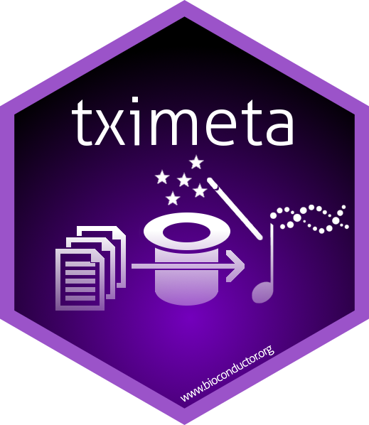

# tximeta 

# Automatic metadata for RNA-seq

*tximeta* provides a set of functions for conveniently working with
metadata for transcript quantification data in Bioconductor. The
[`tximeta()`](https://thelovelab.github.io/tximeta/reference/tximeta.md)
function imports quantification data from *salmon* or related
quantifiers, and returns a
[SummarizedExperiment](https://bioconductor.org/packages/release/bioc/vignettes/SummarizedExperiment/inst/doc/SummarizedExperiment.html#anatomy-of-a-summarizedexperiment)
object. *tximeta* works natively with
[salmon](https://salmon.readthedocs.io/en/latest/),
[alevin](https://salmon.readthedocs.io/en/latest/alevin.html),
[piscem-infer](https://piscem-infer.readthedocs.io/en/latest/), and
[oarfish](https://github.com/COMBINE-lab/oarfish), but can easily be
configured to work with any transcript quantification tool.

If
[`tximeta()`](https://thelovelab.github.io/tximeta/reference/tximeta.md)
recognizes the reference transcripts used for quantification, it will
automatically download relevant information about the location of the
transcripts in the correct genome. *These actions happen in the
background without requiring any extra effort or information from the
user.*

This metadata is attached to the *SummarizedExperiment* in the
`metadata()` and `rowRanges()` or `rowData()` slots.

For a list of the reference transcriptomes supported by
[`tximeta()`](https://thelovelab.github.io/tximeta/reference/tximeta.md),
see the “Pre-computed digests” section of the vignette in the
`Get started` tab. Note that in *tximeta* documentation, we call the
computed identifier for the reference transcriptome a “digest” or
sometimes a “checksum”, which is produced by hash function(s) employed
by upstream software.

Further steps are also facilitated, e.g. `summarizeToGene()`,
[`addIds()`](https://thelovelab.github.io/tximeta/reference/addIds.md),
or even
[`retrieveCDNA()`](https://thelovelab.github.io/tximeta/reference/retrieveCDNA.md)
(the transcripts used for quantification) or
[`retrieveDb()`](https://thelovelab.github.io/tximeta/reference/retrieveDb.md)
(the correct *TxDb* or *EnsDb* to match the quantification data).

# How it works

The key idea behind *tximeta* is that *Salmon*, *alevin*, and
*piscem-infer* propagate a hash value summarizing the reference
transcripts into each quantification directory it outputs. *tximeta* can
be used with other tools as long as the [hash of the
transcripts](https://github.com/COMBINE-lab/FastaDigest) is also
included in the output directories. See `customMetaInfo` argument of
[`tximeta()`](https://thelovelab.github.io/tximeta/reference/tximeta.md)
for more details.

Diagram of tximeta workflow

In the Bioconductor 3.22 release (October 2025), tximeta’s long read
import pipeline was updated to support mixed reference transcripts,
where [oarfish](https://github.com/COMBINE-lab/oarfish) is used to
quantify against a combination of `--annotated` (e.g. GENCODE, Ensembl)
and `--novel` (e.g. *de novo* assembled) reference transcripts. New
functions
[`importData()`](https://thelovelab.github.io/tximeta/reference/importData.md),
[`inspectDigests()`](https://thelovelab.github.io/tximeta/reference/inspectDigests.md),
and
[`updateMetadata()`](https://thelovelab.github.io/tximeta/reference/updateMetadata.md)
facilitate import and automatic metadata attachment across both
reference sets. See the [mixed reference
transcripts](https://thelovelab.github.io/tximeta/articles/tximeta.html#mixed-reference-transcripts)
section of the vignette for details.

Diagram of tximeta mixed reference workflow

# Reference

A reference for *tximeta* package is:

> Michael I. Love, Charlotte Soneson, Peter F. Hickey, Lisa K. Johnson,
> N. Tessa Pierce, Lori Shepherd, Martin Morgan, Rob Patro. “Tximeta:
> reference sequence checksums for provenance identification in RNA-seq”
> *PLOS Computational Biology* (2020) [doi:
> 10.1371/journal.pcbi.1007664](https://doi.org/10.1371/journal.pcbi.1007664)

# Feedback

We would love to hear your feedback. Please post to [Bioconductor
support site](https://support.bioconductor.org) for software usage help
or post an [Issue on
GitHub](https://github.com/mikelove/tximeta/issues), for software
development questions.

# Funding

tximeta was developed as part of NIH NHGRI R01-HG009937.

tximeta was also supported by the Chan Zuckerberg Initiative as part of
the EOSS grants.

CZI logo
